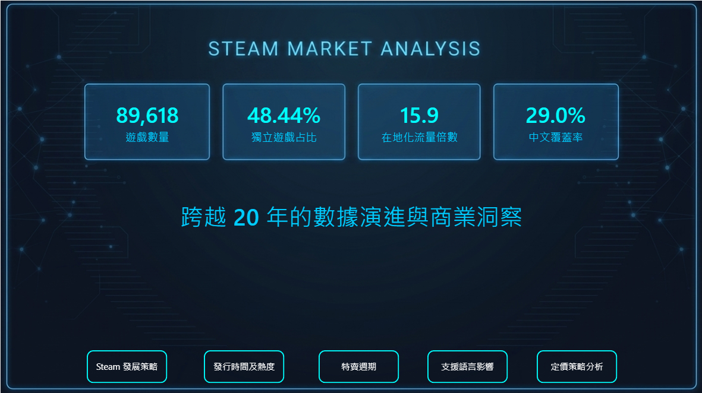
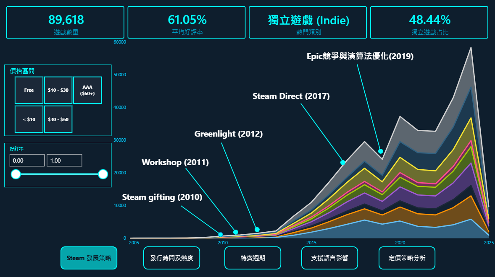
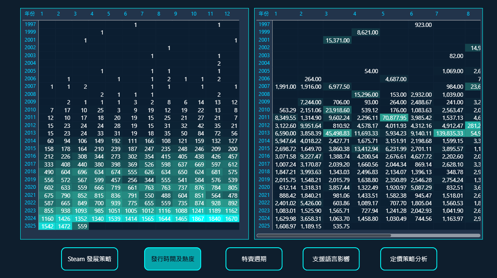

# 🚀 Steam 全球遊戲市場分析專題 (1997-2024)

本專題針對 Steam 平台 20 年間的 **89,618 筆** 遊戲數據進行深度解構，涵蓋資料清理 (ETL)、多維度建模與商業策略洞察。

---

## 📌 核心洞察 (Key Insights)
* **市場結構：** 獨立遊戲 (Indie) 佔比達 **48.44%**。
* **在地化價值：** 在地化流量倍數高達 **15.9 倍**。
* **特賣策略：** 秋季與黑五特賣為年度黃金發行檔期。
* **營收甜蜜點：** **$30 - $59.99** 定價搭配多語系支援具備最高潛力。

---

## 🛠️ 技術棧 (Technical Stack)
* **資料獲取：** Kaggle
* **資料處理：** Python
* **資料建模：** DAX
* **視覺化：** Power BI

---

## 🧹 資料處理細節 (Data Cleaning)
1. **語系規整：** 處理原始標籤為標準維度（繁中、簡中、雙語）。
2. **異常值剔除：** 處理價格異常與長尾無效數據。
3. **時間工程：** 提取年份、季節以進行「特賣週期」分析。
4. **COVID-19 標記：** 加入時間錨點觀察宅經濟效應。

---
## 🖼️ 報表預覽 (Dashboard Preview)

| 首頁 | 銷售 | 客群 |
| :---: | :---: | :---: |
||||
---

## 🚀 快速上手步驟 (Quick Start)

為了驗證此報表的功能，請依照以下步驟操作：

1.  **環境準備**：確保您的電腦已安裝 [Power BI Desktop](https://powerbi.microsoft.com/desktop/)。
2.  **下載專案**：複製（Clone）此倉庫或下載所有的檔案並解壓縮。
3.  **配置數據路徑** 💡：
    * 開啟 `Analysis_Report.pbit` 檔案。
    * 在跳出的 **「資料檔案路徑來源」** 視窗中，輸入您電腦中 `Sales_csv.csv` 的**完整絕對路徑**。
    * *提示：在 Windows 中對檔案按 `Shift + 右鍵` 選擇「複製為路徑」最為準確。*
4.  **生成報表**：點擊「載入」後，系統將自動完成數據對接並呈現分析畫面。

---

## 👤 作者
* **鄭朝元** | 朝陽科技大學 資訊管理系
## 🤝 個人首頁 (Contact)
[個人首頁](https://rhea95032.github.io/)